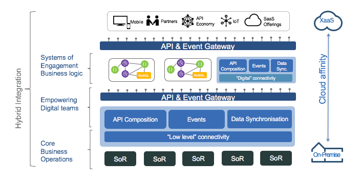
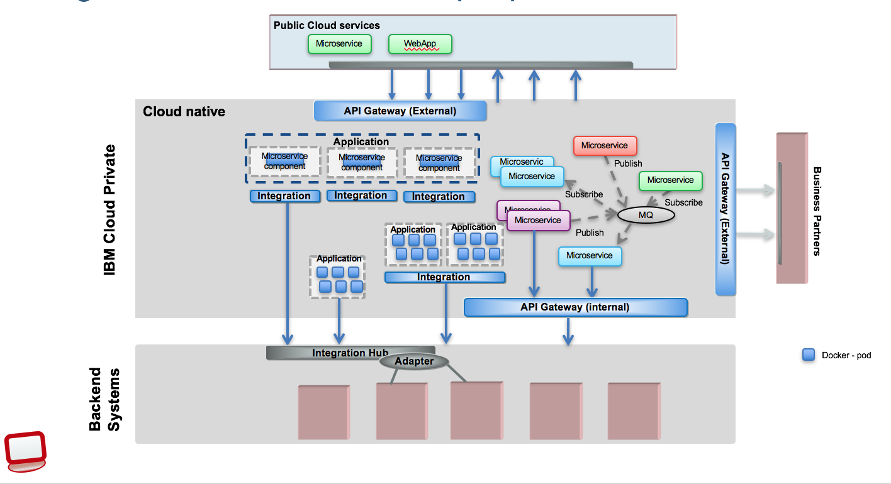
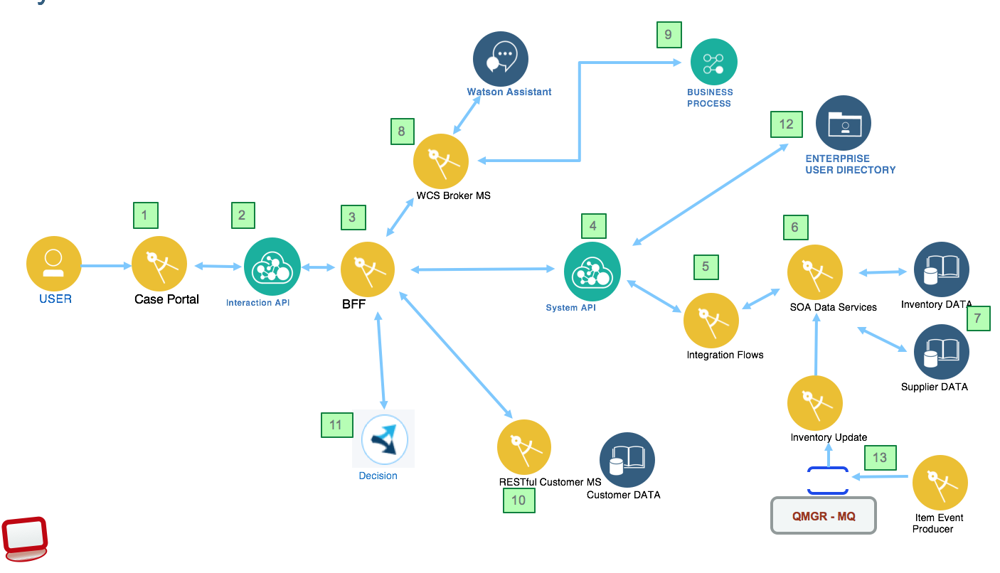

# Hybrid Integration Reference Architecture

IT environments are becoming hybrid in nature; most businesses use cloud computing as part of their overall IT environment. While businesses continue to operate enterprise applications, processes, and systems of record on premises, they are rapidly developing cloud-native applications on cloud. The [hybrid integration reference architecture](https://www.ibm.com/cloud/garage/content/architecture/integrationServicesDomain/) describes an approach to connect components which are split across cloud and on-premises environments, or across public and private clouds -- even across different cloud providers.

Updated (03/16/2018)

## Target audiences
This solution implementation covers a lot of different and interesting subject. If you are...
* an architect, you will get a deeper understanding on how all the components work together, and how to address API economy, support cloud native polyglot applications and micro service while leveraging your existing investments in SOA and ESB pattern.
* a developer, you will get a broader view of the solution end to end and get existing starting code, and practices you may want to reuse during your future implementation. We focus on hybrid cloud and private cloud so some interesting areas like CI/CD in hybrid are covered. Test Driven Development with consumer driven contract testing.
* a project manager, you may understand all the artifacts to develop in an hybrid integration solution, and we may help in the future to do project estimation.
* a marketing person, you may want to google something else...

## Table of Contents
* [Introduction](#introduction)
* [What you will learn](#what-you-will-learn)
* [Application Overview](#application-overview)   
* [Build, deploy and run](./docs/build-run.md)
* [Non-functional requirements](./docs/nfr.md)
* [Compendium](./docs/compendium.md)
* [Contribute to the solution](#contribute)
* [Project Status](#project-status)

## Introduction
In this architecture, existing applications are moved to the infrastructure as a service (IaaS) of cloud providers, new applications are built on the cloud as a platform as a service (PaaS), using pre-built cloud-based software as a service (SaaS) services.

The following diagram presents the high level view of the components involved in the hybrid integration reference architecture. For an deeper explanation of this architecture read [this note](./docs/hybrid-ref-arch.md)
.

Each component may run on-premises, IaaS, PaaS or SaaS.

This current project provides a reference implementation for building and running an **hybrid integration** solution, using cloud native web application **securely** connected to an enterprise data source and SOA services running on on-premise servers. We want to illustrate how to leverage existing SOA / Traditional IT landscape with products such as ESB, BPM, rule engine, Java based web service applications or even event driven publishers. Remember that the core purpose of SOA was to expose data and functions buried in systems of record over well-formed, simple-to-use, synchronous interfaces such as web services.
In the longer term the brown compute will support the multiple integration patterns as presented in the figure below, and for more information please read [this note](docs/hybrid-itg-platform.md):

### What you will learn
One of the goal of this implementation is to reflect what is commonly found in IT landscape in 2017, and provides recommendations on how to manage hybrid architecture with the cloud programming model by addressing non-functional requirements as scalability, security, monitoring and resiliency.

By studying the set of projects and articles linked to this top repository, you will learn:
- how to develop a [SOAP app in Java](https://github.com/ibm-cloud-architecture/refarch-integration-inventory-dal#code-explanation) using JPA, JAXWS deployed on WebSphere Liberty
- how to develop [gateway message flow](https://github.com/ibm-cloud-architecture/refarch-integration-esb#inventory-flow) with IBM Integration Bus
- how to define [API product](https://github.com/ibm-cloud-architecture/refarch-integration-api#implementation-details) with API Connect, and use secure communication with TLS
- how to set up secure connection from public cloud to on-premise service using Secure Gateway
- how to develop a [Angular 4 app](https://github.com/ibm-cloud-architecture/refarch-caseinc-app#code-explanation) using a Test Drive Development approach with nodejs/expressjs back end
- how to [secure the web app with passport](https://github.com/ibm-cloud-architecture/refarch-caseinc-app/blob/master/docs/login.md)
- how to access existing LDAP service for user authentication
- how to perform CI/CD in hybrid world
- how to monitor all those components using Application Performance Monitoring
- how to deploy most of the components of the solution to IBM Cloud Private
- how to adopt a test focus implementation
- How to call BPM process from Watson Conversation (orchestration), and how to integrate chat user interface connected to Watson Conversation into BPM coach.

## Application Overview
As an hybrid cloud solution implementation the set of projects of this solution cover different **functional** requirements:
* A web based portal to integrate internal applications for internal users.
* One of the function is to manage a simple computer product inventory, with  warehouse and suppliers.
* Support a chat bot for IT support questions
* Support customer management, buyer of the computer products and used for analytics
* Product recommendations based on business rules

### System context
As architect we need to develop a system context, so the following diagram illustrates the logical components involved in the current solution, with the numbered items for short explanation:  

(the links below send you to the corresponding git repository where you can get specific deeper dive and executable code and scripts)
1. [Web App "Case Portal"](https://github.com/ibm-cloud-architecture/refarch-caseinc-app) Portal web app (Angular 4) exposes a set of capabilities to internal users for inventory management, chatbots...
1. Interaction APIs exposes API products for public WebApp consumptions. Those [APIs](https://github.com/ibm-cloud-architecture/refarch-integration-api) support specific resources needed by user interface app and the channels they serve.
1. Back End For Front End to support business logic of the web app, and simple integration of RESTful services. This is currently the server part of the [web app](https://github.com/ibm-cloud-architecture/refarch-caseinc-app)). We want to separate the Angular 4 static pages so it can be deployed on HTTP server like NGinx, as of now the BFF ([Back-end For Front-end pattern](http://philcalcado.com/2015/09/18/the_back_end_for_front_end_pattern_bff.html)) is nodejs app serving the Angular single page application. BFF pattern is still prevalent for mobile applications and single-page web applications. In this pattern, APIs are created specifically for the front-end application and perfectly suited to its needs with rationalized data models, ideal granularity of operations, specialized security models, and more. We are migrating to be a separate component.
1. System API to define backend service API product ([inventory APIs](https://github.com/ibm-cloud-architecture/refarch-integration-api/blob/master/docs/apic-to-soap.md)), used by multiple consumers.
1. Mediation flow deployed on Integration Bus to connect to back end systems and SOA services, and do interfaces mapping and [mediation flows](https://github.com/ibm-cloud-architecture/refarch-integration-esb).
1. [Data SOA, Java WS service](https://github.com/ibm-cloud-architecture/refarch-integration-inventory-dal) to expose a data access layer on top of relational item, inventory, supplier database
1. Db2 deployment of the [Inventory and Supplier](https://github.com/ibm-cloud-architecture/refarch-integration-inventory-db2) database.
1. [Watson conversation broker micro service](https://github.com/ibm-cloud-architecture/refarch-cognitive-conversation-broker) to facade and implement orchestration and business logic for chatbots using Watson Conversation IBM Cloud service.
1. [Supplier on boarding process](https://github.com/ibm-cloud-architecture/refarch-cognitive-supplier-process), deployed as human centric process on IBM BPM on Cloud and triggered by Watson Conversation chatbot, or integration chat bot into BPM coach
1. [Customer management for analytics](https://github.com/ibm-cloud-architecture/refarch-integration-services) micro services to support RESTful API.
1. Decision engine to automate business rules execution and Management for [product recommendation in the context of user moving in different location](https://github.com/ibm-cloud-architecture/refarch-cognitive-prod-recommendations)
1. [LDAP for user Management](https://github.com/ibm-cloud-architecture/refarch-integration-utilities#ldap-configuration) to centralize authentication use cases.

We have other repositories to address...
* [Testing](https://github.com/ibm-cloud-architecture/refarch-integration-tests) This repository includes a set of test cases to do component testing, functional testing and integration tests.

### User interface
To demonstrate the set of features of this solution , a front end application, representing an internal portal is used to plug and play the different use cases. There is a login mechanism connected to a directory service (LDAP)

  

This front end application is an extension of the "CASE.inc" retail store introduced in [cloud native solution or "Blue compute"](https://github.com/ibm-cloud-architecture/refarch-cloudnative) which manages old computers, extended with IT support chat bot and other goodies.

## Contribute
We welcome your contribution. There are multiple ways to contribute: report bugs and improvement suggestion, improve documentation and contribute code.
We really value contributions and to maximize the impact of code contributions we request that any contributions follow these guidelines
* Please ensure you follow the coding standard and code formatting used throughout the existing code base
* All new features must be accompanied by associated tests
* Make sure all tests pass locally before submitting a pull request
* New pull requests should be created against the integration branch of the repository. This ensures new code is included in full stack integration tests before being merged into the master branch.
* One feature / bug fix / documentation update per pull request
* Include tests with every feature enhancement, improve tests with every bug fix
* One commit per pull request (squash your commits)
* Always pull the latest changes from upstream and rebase before creating pull request.

If you want to contribute, start by using git fork on this repository and then clone your own repository to your local workstation for development purpose. Add the up-stream repository to keep synchronized with the master.
## Project Status
[03/2018] This project is still under active development, so you might run into [issues](https://github.com/ibm-cloud-architecture/refarch-integration/issues). If you do, please don't be shy about letting us know, or better yet, contribute a fix or feature.
Here is a high level plan of future working
* Use IIB message flow packaged with IIB as mediation flow micro service
* CI/CD end to end
* Add App connect as integration product for SaaS and automate tasks
* Add ODM to compute product recommendation
* consumer contract testing for Angular web app to service provider
* Separate BFF from angular app.
* Run angular app on nginx
* Explain a TDD approach to develop the Angular app
* Add MQ messaging. 
