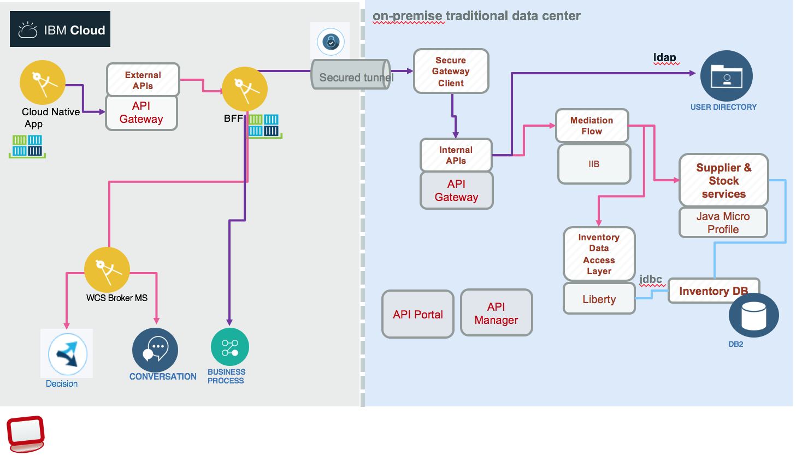

# Build, Deploy and Run
In this article we explain how to build, deploy and run all the components of the solution. Each project covers detail on how to build and run.
We are covering different configurations to represent interesting challenges:
1. the Web Application, BFF and API Management can run on public cloud and the other legacy components on-premise

  

  See the [deploy webapp to IBM Cloud Container Service IBM Cloud](./docs/run-bmx-cs.md). as an alternate, last year we started by using [IBM Cloud using Cloud Foundry](./docs/run-bmx-cf.md) but for portability reason we move to container.

1. we deploy a lot of the components on IBM Cloud Private, calling IBM cloud services and on-premise backend as illustrated in the figure below:

 

See detail in [Deployment to IBM Cloud Private article](./docs/icp/README.md)


# deployment
The component view and physical deployment for the IBM Cloud to on-premise servers configuration looks like the image below:


From left to right:
* The [Case Inc Portal app](https://github.com/ibm-cloud-architecture/refarch-caseinc-app) defines a set of user interface to manage Inventory elements, it is a modern Angular 4 / nodejs app which uses the [Back-end For Front-end pattern](http://philcalcado.com/2015/09/18/the_back_end_for_front_end_pattern_bff.html).
 The general-purpose API backend is implemented in ESB running on-premise. The client specific APIs to serve the Angular js app are done in this BFF component.

* The nodejs/expressjs accesses the REST api exposed by API Connect via a [Secure Gateway service](https://github.com/ibm-cloud-architecture/refarch-integration-utilities/blob/master/docs/ConfigureSecureGateway.md) on IBM Cloud which acts as a proxy or via direct VPN connection. This application is containized and deployable on Kubernetes cluster. See [this repository.](https://github.com/ibm-cloud-architecture/refarch-caseinc-app)

* The connection between public cloud and internal IT resources, is done via a VPN IPsec tunnel or [IBM Secure Gateway](https://github.com/ibm-cloud-architecture/refarch-integration-utilities/blob/master/docs/ConfigureSecureGateway.md). As of now we are using IBM Secure Gateway Client on a dedicated server. This server is called [BrownUtilityServer and the installation and configuration is detailed here ](https://github.com/ibm-cloud-architecture/refarch-integration-utilities).

* [API Connect](https://github.com/ibm-cloud-architecture/refarch-integration-api), installed on-premise, is used as API gateway to the different API run times.

* [IBM Integration Bus](https://github.com/ibm-cloud-architecture/refarch-integration-esb), is used to do interfaces mapping between the SOAP data access layer, implemented in Java, and the RESTful API exposed to the public applications. For detail see [this note](docs/iib.md)

* The **Data Access Layer** is a JAXWS application running on WebSphere Liberty server and exposing a set of SOAP services. The server is *BrownLibertyAppServer*. See [this repository](https://github.com/ibm-cloud-architecture/refarch-integration-inventory-dal) for detail.

* The inventory **database** is running on DB2 and is not directly accessed from API connect, but applying SOA principles, it is accessed via a Data Access Layer app. The server is *BrownDB2*.


The 'top of the iceberg' for this solution implementation is the cloud native app 'Case Inc Portal' that offers accesses to the Inventory management and other features such as IT support chatbot. The details on how to build and run this web application is [here.](https://github.com/ibm-cloud-architecture/refarch-caseinc-app)

To run the backend solution, we will deliver images for you to install on your servers... stay tuned, from now we are describing how each server is configured in each of the specific github repository. We are using VmWare vSphere product to manage all the virtual machines. The figure below presents the *Brown* Resource Pool with the current servers:   


## Prerequisites
* You need your own [github.com](http://github.com) account
* You need a git client code. For example for [Windows](https://git-scm.com/download/win) and for [Mac](https://git-scm.com/download/mac)
* Install [npm](https://www.npmjs.com/get-npm) and [nodejs](https://nodejs.org). Normally getting nodejs last stable version will bring npm too.
* You need to have some knowledge on using virtual machine images and tool like vSphere.
* As we are migrating to IBM Cloud Private a set of components run as docker container in pods.

## The Current Physical Deployment and Installation
The  Current Physical deployment includes six servers, we are describing how installations were done in separate git hub repository so you can replicate the configuration if you want. It should take you 1 to 2 hours per server.
As an alternate and easier approach we are delivering a Vagrant file and explanation on how to use it [here](vm/README.md)
* DB2 server read [this note](https://github.com/ibm-cloud-architecture/refarch-integration-inventory-db2#db2-server-installation)
* Liberty App server read [this article](https://github.com/ibm-cloud-architecture/refarch-integration-inventory-dal/blob/master/docs/liberty-server.md)
* IBM Integration Bus see [this article]().
* API Connect see [Server config](https://github.com/ibm-cloud-architecture/refarch-integration-api#server-configuration)
* Open LDAP Server running on the utility server [LDAP Configuration](https://github.com/ibm-cloud-architecture/refarch-integration-utilities#ldap-configuration)
* [Utility Server](https://github.com/ibm-cloud-architecture/refarch-integration-utilities#server-configuration) runs IBM Secure Gateway and [Jenkins server](https://github.com/ibm-cloud-architecture/refarch-integration-utilities/blob/master/docs/cicd.md#installation)  

As part of the hybrid integration compute mission is to leverage the VM lift and shift approach by deploying vm image to IBM Cloud VM.

## Get application source code
Clone this base repository using git client:
```
git clone https://github.com/ibm-cloud-architecture/refarch-integration.git
```

Then under the refarch-integration folder use the command ``` ./clonePeers.sh ``` to clone the peer repositories of the 'hybrid integration compute' solution.

Finally the first time you get the code, use the ```./configureAll.sh``` script to perform the different dependency installations for the IBM Cloud apps and other utilities.

### Working on your own
The script ` ./fork-repos.sh` should help you to fork all the repositories of this solution within your github account.

## Run on premise servers
There are multiple steps to make the solution working. Be sure to start each sever in the following order:
* Start DB2 server
* Start App server
* Start IIB
* Start API Connect servers: Gateway, Management and Portal
* Start Utility server
* Start 'case inc' portal APP

The [testing project](https://github.com/ibm-cloud-architecture/refarch-integration-tests) implements a set of test cases to validate each of the component of this n-tier architecture. It is possible to validate each component work independently.

The demonstration script instructions are [here](https://github.com/ibm-cloud-architecture/refarch-caseinc-app/blob/master/docs/demoflow.md)

For demonstration purpose not all back end servers are set in high availability.

## Run on IBM Cloud Private
Most of the components of this solution can run on IBM Cloud Private we are detailing it [here](docs/icp-deploy.md)

## Run on IBM Cloud Container Service
See this detail note [here](docs/run-bmx-cs.md) to deploy and run the Web App as container inside the [IBM Cloud Container Service](https://console.bluemix.net/docs/containers/container_index.html).

## Run on IBM Cloud Cloud Foundry
See this detail note [here](./docs/run-bmx-cf.md) to deploy the Web App as cloud foundry app on IBM Cloud
