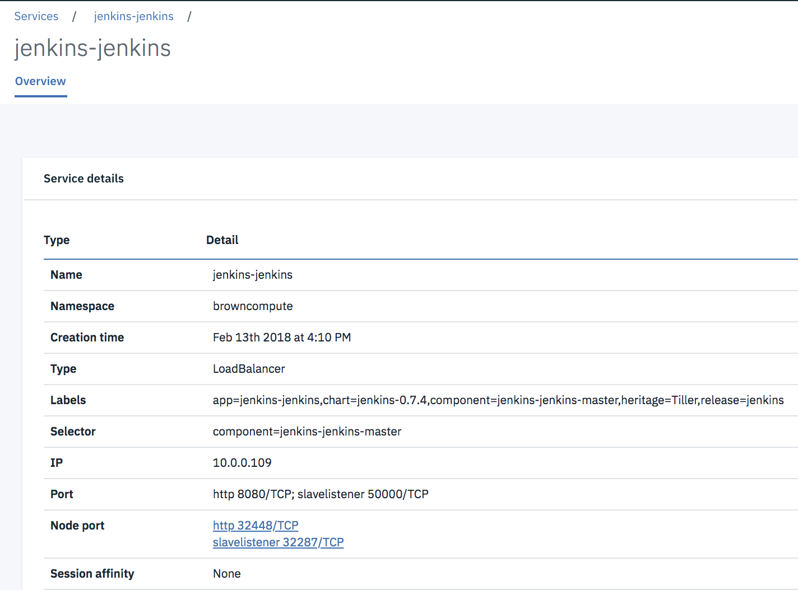

# DevOps  
With all the components involved in this solution we want to enable CI/CD to deploy artifacts to on-premise server and on IBM Cloud Private kubernetes cluster.

# Continuous integration with Jenkins
For continuous integration and deployment we are using a `Build server` with [Jenkins](http://jenkins.io) server deployed on it. With Jenkins we can do continuous build, execute non regression tests, integration tests and deployment of each components to different target servers.

# Table of content
* [Installation](#installation)
* [Pipeline definition](#pipeline)
* [Specific project CI/CD](#projects_build)

## Installation
There are multiple ways to install Jenkins server: using a dedicated VM server installing the binary or running as docker container, or deploy the jenkins helm release to IBM Cloud Private.
### Jenkins on ICP
* Add the public kubernetes repositiries, using the admin console > Manager > Repositories and use the URL: https://github.com/kubernetes/charts/tree/master/stable
* Create a Persistence Volume Claim named `jenkins-home`

* Then install the chart
```
helm install --name jenkins --set Persistence.ExistingClaim=jenkins-home --set Master.ImageTag=2.67 stable/jenkins
```
* Once the pod is started, the service exposes a NodePort as you can see in the figure below:
  

so going to the address should launch the console. You need to access the initial admin password. The following command may not give the expected password:

```
$ printf $(kubectl get secret --namespace browncompute jenkins-jenkins -o jsonpath="{.data.jenkins-admin-password}" | base64 --decode);echo
```
As an alternate solution, try to remote connect to the pods and then navigating to the good path to see the password persisted in a file named `initialAdminPassword`:
```
$ kubectl exec -ti jenkins-jenkins-7995cd796f-btdjz  /bin/bash
$ cd /var/jenkins_home/secrets
$ cat initialAdminPassword
```
* Create a user and change the password. When Jenkins server starts it may be needed to upgrade the deployed version.
* Define configmap and secrets to reference private docker registry, running on the ICP Master node: A file under the charts folder defines the cluster to be `greencluster.icp:8500`
```
$ kubectl create -f docker-reg-configMap.yaml
```
For the secrets we need to encode the user defined for admin and its password. You can use the online encoder at: https://www.base64encode.org/. For `admin` userid the code is `YWRtaW4NCg==`. Reuse the secret yaml file under the charts folder.
```
$ kubectl create -f registry-secret.yaml
```  
* Create pipeline: create new jobs... [See note](#pipeline) below.

See also [this tutorial](https://www.ibm.com/cloud/garage/tutorials/cloud-private-jenkins-pipeline) on Garage method tutorial web page.

### Jenkins on-premise server
The installation is following a non-docker install approach as described [here]( https://jenkins.io/doc/book/getting-started/installing), specially the following steps should be done:
#### Get the jenkins binary and install
```
$ wget -q -O - https://pkg.jenkins.io/debian/jenkins.io.key | sudo apt-key add -
$ sudo sh -c 'echo deb http://pkg.jenkins.io/debian-stable binary/ > /etc/apt/sources.list.d/jenkins.list'
$ sudo apt-get update
$ sudo apt-get install jenkins
```
doing a `ps -ef | grep jenkins` we can see jenkins server is up and running as a java program. Pointing a web browser to http://localhost:8080 goes to the administration wizard to complete the configuration. You need to get the created password using: `sudo cat /var/lib/jenkins/secrets/initialAdminPassword`.
The wizard is also asking for a user, so we used *admin/admin01* and to install the standard plugins.

#### For java you need jdk
As some of the codes of the solution are Java based, we had the JDK (to get `javac` tool and other system jars):
```
$ sudo apt-get install openjdk-8-jdk
```

To automate interaction script like `ssh` and `scp`, we are using [expect](http://expect.sourceforge.net/) tool so password and other input can be injected.
```
$ sudo apt-get install expect
```

#### install docker on the build server
As some of the build steps are to run `docker build`, we need to install docker on build server and authorize jenkins to be a docker user:
```
$ sudo  usermod -aG docker Jenkins
# if jenkins is running restart the server using the web browser to
(jenkins_url)/restart
```
#### Add dependencies for node / angular...
Finally you need to be sure that any dependencies for each project are met. Like for the nodes and angularjs, be sure to have the compatible angular/cli, npm, nodejs (version 6). The following set of commands were used:

```
$ npm cache clean -f
# install nodejs 6
$ curl -sL https://deb.nodesource.com/sertup_6.x | sudo -E bash -
$ sudo apt-get install -y nodejs
$ sudo mpm i -g @angular/cli
```

## Pipeline
Pipelines are made up of multiple steps that allow you to build, test and deploy applications. The following projects define pipeline in jenkinsfile.

* ibm-cloud-architecture/refarch-integration-inventory-dal. This project includes a *jenkinsfile* which defines a build stage to call a shell to execute *gradlew* to compile and package the war file, built under the folder *build/libs*.
* ibm-cloud-architecture/refarch-caseinc-app: The jenkins file performs npm install, npm run build, docker build, and helm package...

The following schema presents how the pipeline works:

1. Jenkins is listening to change / commit to the github public repositories
1. Repositories are cloned and their respective Jenkinsfiles are executed to build war, docker images or helm charts

### Creating Pipeline
Once the Jenkins server is started we need to create a pipeline. So using the **New Item** menu in the administration console: [Build server](http://localhost:8080) add *Web app Build*


Then select the *Pipeline* configuration. This should bring a page with multiple tabs. The following options were selected:
* General:
 * Discard old builds after 2 days and 2 maximum builds
 * Do not allow concurrent builds as there are some dependencies between projects

* Build Triggers
 * Select 'GitHub hook Trigger..'
* Pipeline
 * Pipeline script from SCM: *as each project has a Jenkinsfile*
 * SCM is git and then specify the project to build.
  * http//github.com/ibm-cloud-architecture/refarch-caseinc-app
  OR
  * http//github.com/ibm-cloud-architecture/refarch-integration-inventory-dal/

  Use the *Build Now* option to test the build. You should get the results like:  
  

The folder where code is extracted is /var/lib/jenkins/workspace/BrownBuild@scripts

# Projects build
Each project has its build process that we try to homogenize.
* [Web app build]()
* [Data access layer]()
* [Mediation flow on IIB]()
* [API inventory product]()
* [Integration tests]()
