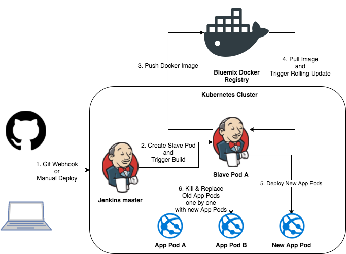
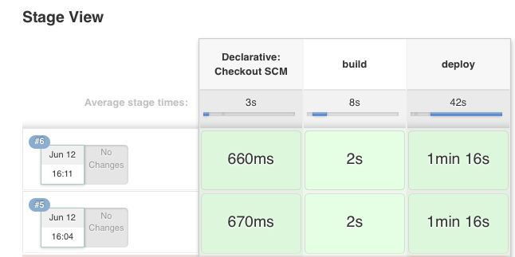

# DevOps  
With all the components involved in this solution we want to enable CI/CD to deploy artifacts to on-premise server and on IBM Cloud Private kubernetes cluster.

# Continuous integration with Jenkins
For continuous integration and deployment we are using a `Build server` with [Jenkins](http://jenkins.io) server deployed on it. With Jenkins we can do continuous build, execute non regression tests, integration tests and deployment of each components to different target servers.

# Table of content
* [Installation](#installation)
    + [Jenkins on IBM Cloud Private (ICP)](#jenkins-on-ibm-cloud-private-icp)
        - [Helm](#helm-chart)
        - [Add Public Helm Repository](#add-public-helm-repository)
        - [Create a Persistence Volume Claim](#create-a-persistence-volume-claim)
        - [Install Jenkins Helm Chart](#install-jenkins-helm-chart)
        - [Accessing Jenkins](#accessing-jenkins)
        - [Retrieve the Jenkins Admin Password](#retrieve-the-jenkins-admin-password)
        - [Configure Docker Repository](#configure-docker-repository)
        - [Optional: Create Service Account](#optional-create-service-account)
        - [Optional: Updating Jenkins Plugins](#optional-updating-jenkins-plugins)
    + [Jenkins on-premise server](#jenkins-on-premise-server)
        - [Get the jenkins binary and install](#get-the-jenkins-binary-and-install)
        - [For java you need jdk](#for-java-you-need-jdk)
        - [install docker on the build server](#install-docker-on-the-build-server)
        - [Add dependencies for node / angular...](#add-dependencies-for-node--angular)
* [Pipeline](#pipeline)
+ [Creating Pipeline](#creating-pipeline)
* [Projects build](#projects-build)

## Installation
There are multiple ways to install Jenkins server: using a dedicated VM server by installing the binary or running as docker container, or deploy the jenkins helm release to IBM Cloud Private.
### Jenkins on IBM Cloud Private (ICP)
**NOTE:** [ICP v2.1.0.2](https://www.ibm.com/support/knowledgecenter/en/SSBS6K_2.1.0.2/kc_welcome_containers.html) was used at the time of writing this section. See also [this jenkins pipeline tutorial](https://github.com/ibm-cloud-architecture/refarch-cloudnative-devops-kubernetes).

The Jenkins architecture while deployed to kubernetes cluster looks like the diagram below:


The installation process deploys a **Jenkins master** responsible to execute build jobs. Each build jobs is in fact a `slave pod`, so another docker images that executes a jenkins file as defined in the pipeline definition. As application built with this approach are docker containers and helm releases, there is a need to use a docker registry, could be public or private to ICP. To support dynamic pod creation, there is a [jenkins plugin for kubernetes](https://github.com/jenkinsci/kubernetes-plugin) that needs to be installed. This plugin helps to define specific elements in the Jenkins file to execute the build using docker containers.
The installation should install the jenkins master as a helm release, configure some parameters to access private docker repository, and add necessary jenkins plugins. We detail those steps:

#### Helm Chart
In order to install the Jenkins Chart, you need to have the [`Helm`](https://github.com/kubernetes/helm) client configured in your CLI. To install and configure helm, follow the IBM Cloud Private instructions listed [here](https://www.ibm.com/support/knowledgecenter/SSBS6K_2.1.0.2/app_center/create_helm_cli.html).

#### Add Public Helm Repository
* Add the public kubernetes repositories, using the ICP admin console > Manage > Helm Repositories and use the URL: https://github.com/kubernetes/charts/tree/master/stable

#### Create a Persistence Volume Claim
You can skip this section if you already setup a default `storage class` for `dynamic provisioning`, as explained [here](https://www.ibm.com/support/knowledgecenter/en/SSBS6K_2.1.0.2/manage_cluster/cluster_storage.html).

If you don't have dynamic provisioning setup, we recommend you read this [document](https://www.ibm.com/support/knowledgecenter/en/SSBS6K_2.1.0.2/manage_cluster/create_app_volume.html), which goes into detail on how to create a `Persistent Volume Claim (PVC)`, which we can pass on to the `helm install` command for Jenkins installation. For this example, the PVC has the following requirements:
* Needs to be at least 8GB
* It should be called `jenkins-home`

#### Install Jenkins Helm Chart

To **Install the Jenkins Chart and Provision a PVC dynamically**, use the following command:
```bash
$ helm install --namespace default --name jenkins --version 0.14.4 \
    --set Master.ImageTag=2.117 \
    --set Master.ServiceType=NodePort \
    --set Master.InstallPlugins.0=kubernetes:1.5.2 \
    --set Master.InstallPlugins.1=workflow-aggregator:2.5 \
    --set Master.InstallPlugins.2=workflow-job:2.19 \
    --set Master.InstallPlugins.3=credentials-binding:1.16 \
    --set Master.InstallPlugins.4=git:3.8.0 \
    --set Agent.ImageTag=3.19-1 \
    --set rbac.install=true \
    stable/jenkins --tls;
```

To **Install the Jenkins Chart and Pass an Existing PVC**, use the following command:
```bash
$ helm install --namespace default --name jenkins --version 0.14.4 \
    --set Master.ImageTag=2.117 \
    --set Master.ServiceType=NodePort \
    --set Master.InstallPlugins.0=kubernetes:1.5.2 \
    --set Master.InstallPlugins.1=workflow-aggregator:2.5 \
    --set Master.InstallPlugins.2=workflow-job:2.19 \
    --set Master.InstallPlugins.3=credentials-binding:1.16 \
    --set Master.InstallPlugins.4=git:3.8.0 \
    --set Persistence.ExistingClaim=jenkins-home \
    --set Agent.ImageTag=3.19-1 \
    --set rbac.install=true \
    stable/jenkins --tls;
```

To **Install the Jenkins Chart without a PVC**, use the following command:
```bash
$ helm install --namespace default --name jenkins --version 0.14.4 \
    --set Master.ImageTag=2.117 \
    --set Master.ServiceType=NodePort \
    --set Master.InstallPlugins.0=kubernetes:1.5.2 \
    --set Master.InstallPlugins.1=workflow-aggregator:2.5 \
    --set Master.InstallPlugins.2=workflow-job:2.19 \
    --set Master.InstallPlugins.3=credentials-binding:1.16 \
    --set Master.InstallPlugins.4=git:3.8.0 \
    --set Persistence.Enabled=false \
    --set Agent.ImageTag=3.19-1 \
    --set rbac.install=true \
    stable/jenkins --tls;
```

Once the pod is started, the service exposes a NodePort as you can see in the figure below:


#### Accessing Jenkins
The `helm install` command should have printed out instructions to get the Jenkins URL similar to this:
```
NOTES:
...
2. Get the Jenkins URL to visit by running these commands in the same shell:
  export NODE_PORT=$(kubectl get --namespace default -o jsonpath="{.spec.ports[0].nodePort}" services jenkins)
  export NODE_IP=$(kubectl get nodes --namespace default -o jsonpath="{.items[0].status.addresses[0].address}")
  echo http://$NODE_IP:$NODE_PORT/login

```

Now open a new browser window and enter the URL from above to access Jenkins UI.

#### Retrieve the Jenkins Admin Password
The `helm install` command should have printed out instructions to get the Jenkins Admin Password similar to this::
```bash
NOTES:
1. Get your 'admin' user password by running:
  printf $(kubectl get secret --namespace default jenkins -o jsonpath="{.data.jenkins-admin-password}" | base64 --decode);echo
```

As an alternate solution, try to remote connect to the pods and then navigating to the `/var/jenkins_home/secrets` path to see the password persisted in a file named `initialAdminPassword`:
```bash
$ kubectl exec -it jenkins-jenkins-7995cd796f-btdjz /bin/bash
$ cd /var/jenkins_home/secrets
$ cat initialAdminPassword
```

#### Configure Docker Repository
In order for the pipelines to know where to push newly built docker images, you need to configure what docker registry to use. To do so, you need to create 2 files:
* A `ConfigMap` that specifies the registry location.
    + In this case, we are going to use ICP's internal docker registry.
* A `Secret` that has the registry login credentials.
    + In this case, the credentials are the ones used to log into ICP's console.

To create the docker registry configmap, feel free to enter the registry location in the `registry` field in the [registry/configmap.yaml](registry/configmap.yaml) file, then create the ConfigMap as follows:
```bash
$ kubectl --namespace default create -f registry/configmap.yaml
```

For the docker registry secret, we need to base64-encode the registry's username and password. The [registry/secret.yaml](registry/secret.yaml) file contains base64-encoded credentials for username `admin` and password `admin`. Assuming your credentials are different, you need to replace those values with your base64-encoded credentials and save the file. You can use the online encoder at: https://www.base64encode.org/. To create the Secret, use the following command:
```bash
$ kubectl --namespace default create -f registry/secret.yaml
```

You now have a fully Configured Jenkins Server inside your ICP cluster!

#### Optional: Create Service Account
If using a non-default namespace, or if Jenkins is unable to create slave pods, you may need to tell Jenkins to use the service account in the namespace in order to create new pods. To do so, follow these instructions:
* Create a Jenkins credential of type Kubernetes service account with service account name provided in the helm status output.
* Under configure Jenkins -- Update the credentials config in the cloud section to use the service account credential you created in the step above.

#### Optional: Updating Jenkins Plugins
Though we specified the versions of the Jenkins plugin needed to run pipelines in the `helm install` command, if new plugin updates come out Jenkins may ask you to upgrade the plugins in order to keep pipelines running. To do so, go to the `Plugin Manager` in `http://JENKINS_IP:PORT/pluginManager/` menu and update the plugins.

### Jenkins on-premise server
The installation is following a non-docker install approach as described [here]( https://jenkins.io/doc/book/getting-started/installing), specially the following steps should be done:

#### Get the jenkins binary and install
```bash
$ wget -q -O - https://pkg.jenkins.io/debian/jenkins.io.key | sudo apt-key add -
$ sudo sh -c 'echo deb http://pkg.jenkins.io/debian-stable binary/ > /etc/apt/sources.list.d/jenkins.list'
$ sudo apt-get update
$ sudo apt-get install jenkins
```

doing a `ps -ef | grep jenkins` we can see jenkins server is up and running as a java program. Pointing a web browser to http://localhost:8080 goes to the administration wizard to complete the configuration. You need to get the created password using: `sudo cat /var/lib/jenkins/secrets/initialAdminPassword`.
The wizard is also asking for a user, so we used *admin/admin01* and to install the standard plugins.

#### For java you need jdk
As some of the codes of the solution are Java based, we add the JDK (to get `javac` tool and other system jars):
```bash
$ sudo apt-get install openjdk-8-jdk
```

To automate interaction script like `ssh` and `scp`, we are using [expect](http://expect.sourceforge.net/) tool so password and other input can be injected to any command
```bash
$ sudo apt-get install expect
```

#### install docker on the build server
As some of the build steps are to run `docker build`, we need to install docker on build server and authorize jenkins to be a docker user:
```bash
$ sudo  usermod -aG docker Jenkins
# if jenkins is running restart the server using the web browser to
(jenkins_url)/restart
```
#### Add dependencies for node / angular...
Finally you need to be sure that any dependencies for each project are met. Like for the nodes and angularjs, be sure to have the compatible angular/cli, npm, nodejs (version 6). The following set of commands were used:

```bash
$ npm cache clean -f
# install nodejs 6
$ curl -sL https://deb.nodesource.com/sertup_6.x | sudo -E bash -
$ sudo apt-get install -y nodejs
$ sudo mpm i -g @angular/cli
```

## Pipeline
Pipelines are made up of multiple steps that allow you to build, test and deploy applications. The following projects define pipeline in jenkinsfile.

* ibm-cloud-architecture/refarch-integration-inventory-dal. This project includes a *jenkinsfile* which defines a build stage to call a shell to execute *gradlew* to compile and package the war file, built under the folder *build/libs*.
* ibm-cloud-architecture/refarch-caseinc-app: The jenkins file performs npm install, npm run build, docker build, and helm package...

The following schema presents how the pipeline works:

1. Jenkins is listening to change / commit to the github public repositories
2. Repositories are cloned and their respective Jenkinsfiles are executed to compile, unit test, build war, docker images and deploy to ICP using helm.

### Creating Pipeline
Once the Jenkins server is started we need to create a pipeline. So using the **New Item** menu in the administration console: [Build server](http://localhost:8080) add *Web app Pipeline*


Then select the *Pipeline* configuration. This should bring a page with multiple tabs. The following options were selected:
* General:
    + Discard old builds after 2 days and 2 maximum builds
    + Do not allow concurrent builds as there are some dependencies between projects
* Build Triggers
    + Select 'GitHub hook Trigger..'
* Pipeline
    + Pipeline script from SCM: *as each project has a Jenkinsfile*
    + SCM is git and then specify the project to build.
        - http//github.com/ibm-cloud-architecture/refarch-caseinc-app. OR:
        - http//github.com/ibm-cloud-architecture/refarch-integration-inventory-dal/

  Use the *Build Now* option to test the build. You should get the results like:  
  

The folder where code is extracted is /var/lib/jenkins/workspace/BrownBuild@scripts

## Projects build
Each project has its build process that we try to homogenize.
* [Web app build]()
* [Data access layer]()
* [Mediation flow on IIB]()
* [API inventory product]()
* [Integration tests]()
