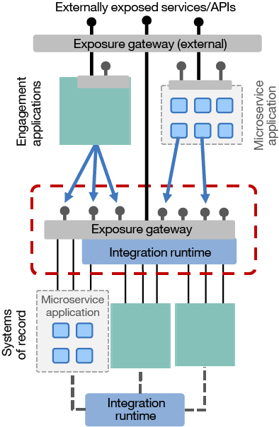

# Hybrid integration platform

The following diagram presents the different hybrid integration patterns, you may find in modern IT where cloud native applications deployed on public cloud (top) can access on-premise resource deployed on IBM Cloud Private (ICP) or more traditional back end systems.
Modern enterprise IT has applications of engagement which typically reside on a public cloud since they are internet facing. These could be mobile, web or applications from business partners that consume external APIs published by the enterprise.

These APIs are exposed externally using a dedicated API Gateway for isolation and provide the required integration to enterprise backend systems.

While enterprise systems are usually considered as systems of record, the adoption of microservices within enterprise IT introduces a layer of separation between backend systems like Databases, ERP systems and application microservices. Applications that are traditionally considered as backend systems could be refactored as microservices for IT modernization. Microservices running on IBM Cloud Private ([ICP](./icp/README.md)) could have different requirements for integration to backend systems depending on their composition. Following are the integration patterns for applications running on ICP:

* Application migrated to ICP connecting to backend systems using integration services running in backend layer.
* Applications and the required integration services are migrated to ICP. Multiple applications can share the integration services.
* Each microservice within an application has a dedicated integration service. This pattern would apply where the microservice and integration service are owned by the same team. The integration service can be shared by other microservices as well e.g integration service defines integration with a backend HR system. The integration services will follow the principles of lightweight integration - https://www.ibm.com/developerworks/cloud/library/cl-lightweight-integration-2/index.html
* Applications with decoupled microservices for robustness could use lightweight publish/subscribe messaging for inter-communication and call backend systems using internal APIs.
* Internal APIs are exposed using a dedicated API Gateway and consumed by internal applications.

The figure below zoom into the pattern of using micro services and application as a group of micro services to support the system of engagement. Those applications are exposing API to the external consumers (mobile app, Single page application) and consume internal / system APIs.

Micro service component could also be used to improve the agility, scalability, and resilience of a system of record. They offer a lot of benefits on the right circumstances. 

These patterns provide integration architectures for modern enterprise applications as they progress through the IT modernization journey.  It is possible that a modern enterprise may have to use all the above integration patterns to meet the application requirements.
