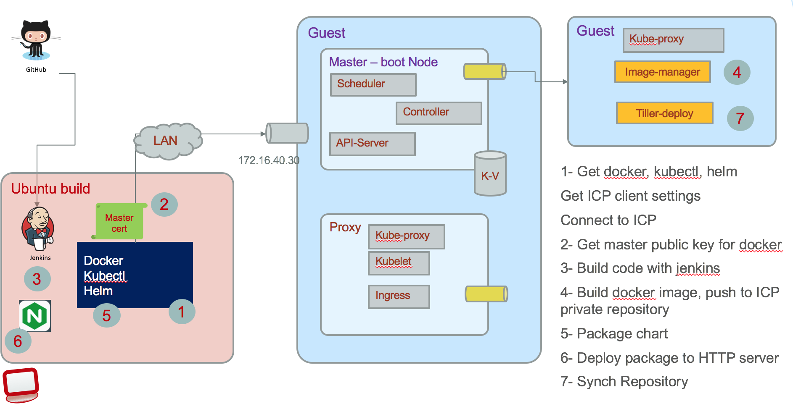
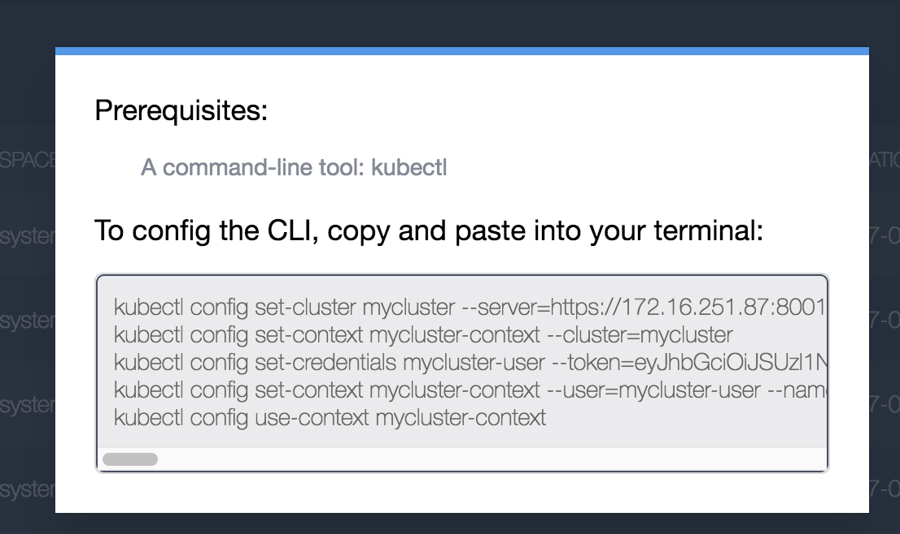

# IBM Cloud Private Deployment
In this section we are presenting how *Hybrid integration compute* is deployed to ICP.

The following diagram presents the target deployment approach.


The Web app is packaged as docker container and deploy to ICP kubernetes cluster, as well as the JAXWS app running on Liberty, and the Gateway flow running on IBM Integration Bus. The LDAP, DB2 server and the API Connect servers are still running on Traditional IT servers. The build server will also stay on-premise as it is used by multiple teams. This approach is to illustrate a real hybrid IT environment or not all the pieces run on cloud based solutions.

# Use a ICP instance for development
We have created a single VM to host ICP for development purpose. The approach is to follow staging environments to promote the code. The detailed steps are documented [here](install-dev-icp21.md)

# Common installation tasks
There are a set of tools and configuration you need to perform, to connect to ICP master node to interact with Kubernetes cluster, docker private registry and helm charts Tiller server.
As an example we are configuring the *build* server to be able to build the different docker images necessary for the solution to work. The figure below illustrates what need to be done:


## Install docker
If you do not have docker install on your development machine, we will not describe it again ;-). See [docker download](https://docs.docker.com/engine/installation/). You need it on the build server where you have Jenkins or other CI tool.

## Install Kubectl
You need to have kubectl on your development computer, on build server and on the ICP development server.
* Install kubectl from ibm image.

```
docker run -e LICENSE=accept --net=host -v /usr/local/bin:/data ibmcom/kubernetes:v1.7.3 cp /kubectl /data
```
the --net=host means to use the host network stack and not the one coming from the container.  -v is for mounting volume: the local /usr/local/bin is mounted to the /data in the container, so the command to cp /kubectl directory inside the container, to /data inside the container will in fact modify the host /usr/local/bin with kubectl CLI. (complex for a simple tar -xvf... but this is our new life...)

see [Docker volume notes](https://docs.docker.com/engine/admin/volumes/volumes/)

* Access the ICP kubernetes cluster information from the ICP Console.
From the Client configuration menu under your userid on the top right of the main console panel:



Copy and paste in a script or in a terminal to execute those commands. So now a command like:
```
kubectl cluster-info
```  
returns the cluster information within ICP.

## Install helm
You can install helm from the helm web site or using Helm packaged with ICP:
```
 docker run -t --entrypoint=/bin/cp -v /usr/local/bin:/data ibmcom/helm:v2.5.0  /helm /data/
```
Command very similar to the one to install kubectl. *--endpoint=* specifies the command to execute when the container starts. Same as *CMD*

Init the client side for helm
```
helm init --client-only
```

If you get the kubectl connected to ICP cluster, then the following command should give you the version of the **Tiller** server running in ICP.
```
helm version
```
See also the [ICP product documentation](https://www.ibm.com/support/knowledgecenter/SSBS6K_2.1.0/app_center/create_helm_cli.html)


# Docker repository
You have two choices: using the private image repository deployed in ICP or create one private docker image repository and declare it inside ICP.

## Access to ICP private repository
You need the public ssh keys of the master-node:
* connect to the VM where the master node returns, get the ip address, and the ca.crt with commands like below:
```
# from my machine
$ cd /etc/docker
$ mkdir certs.d/master.cfc:8500
$ cd certs.d/master.cfc:8500
$ ssh root@masternodevmipaddress
$ cd /etc/docker/certs.d/
$ ls
master.cfc:8500
$ scp master.cfc:8500/ca.crts .
```
The master.cfc:8500 is the name of the cluster as defined in the config.yaml you used during the product installation. 8500 is the port number.

So you copied the public key. An administrator could have sent it to you too.

* Add an entry for master.cfc in your /etc/hosts
```
172.16.5.xxx master.cfc
```

On your computer you need to restart *systemd* and *docker*
```
systemctl daemon-reload
service ssh restart
service docker restart
```

* Normally you should be able to login to remote docker with a userid know to the master node VM
```
docker login master.cfc:8500
User: admin
Password:
```

* Once done the process is the same for each Application
   * build the docker image
   * tag the image with information about the target repository server, namespace, tag and version
   * push the image to the remote repository
   * build the helm package from the chart definition
   * install the package.

## Setup Private Docker Registry
In this section you will set up the private Docker registry in ICP to host the Docker images securely. For this you will create an ICP user to access the registry, and kubernetes configmap and secret resources for the registry configuration and credentials.

# Hybrid integration components
As illustrates in first figure above we are deploying 3 components to ICP
* For IIB study this article: [Deploying IIB Application to IBM Cloud private](https://github.com/ibm-cloud-architecture/refarch-integration-esb/blob/master/IBMCloudprivate/README.md)
* For the web application see [Deploy to ICP](https://github.com/ibm-cloud-architecture/refarch-caseinc-app/blob/master/docs/run-icp.md):
* For the SOA data access layer service running on WebSphere Liberty [Deploy DAL to ICP](https://github.com/ibm-cloud-architecture/refarch-integration-inventory-dal/blob/master/docs/icp-deploy.md)
