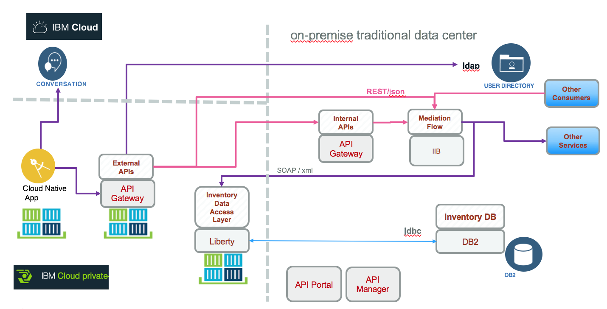
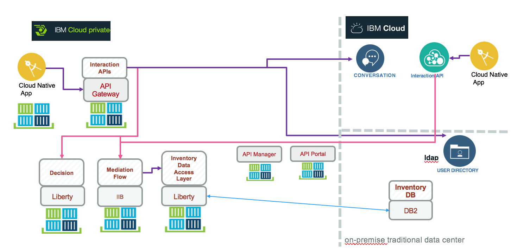

# IBM Cloud Private Deployment
In this section we are presenting how *Hybrid integration compute implementation* is deployed to IBM Cloud Private. For that we will address different configurations as business and operation requirements may differ per data center.

Updated 10/18/2107

## Prerequisites
* A conceptual understanding of how [Kubernetes](https://kubernetes.io/docs/concepts/) works.
* A high-level understanding of [Helm and Kubernetes package management](https://docs.helm.sh/architecture/).
* A basic understanding of [IBM Cloud Private cluster architecture](https://www.ibm.com/support/knowledgecenter/SSBS6K_2.1.0/getting_started/architecture.html).
* Access to an operational IBM Cloud Private cluster.
* Install the IBM Cloud Private command line interface to manage applications, containers, services...
* Add a **brown** namespace using ICP admin console, under Admin > Namespaces menu

We will use this namespace to push brown components.

# ICP installation
For the development purpose, tutorial, etc, we are using a deployment in a single virtual machine, but you will have different installation for each of you different staging environments. See [how to install a ubuntu VM and ICP 2.1](https://github.com/ibm-cloud-architecture/refarch-cognitive/blob/master/docs/ICP/README.txt)

For a full tutorial on how to install ICP with 5 hosts see [this note](https://github.com/ibm-cloud-architecture/refarch-privatecloud/blob/master/Installing_ICP_on_prem.md)

See [ICP 2.1 product documentation](https://www.ibm.com/support/knowledgecenter/SSBS6K_2.1.0/installing/install_containers_CE.html) to get other details.

# Configurations
As an hybrid solution each components of the solution can run on existing on-premise servers or some of the components may run on IBM Cloud private. The decision to move will be linked to business requirements and availability of IBM middleware products as docker image.
For each components of the solution the following needs to be done
   * build the docker image
   * tag the image with information about the target repository server, namespace, tag and version
   * push the image to the remote docker repository
   * build the helm package from the chart definition
   * install the chart to cluster using *helm*
   * access the URL end point

## Cfg 1: Cloud native application on ICP
This is the simplest deployment where the cloud native web application ([the 'case' portal](https://github.com/ibm-cloud-architecture/refarch-caseinc-app)) is deployed as container running in ICP, but it accesses the back end service via API Connect running on-premise. All other components run on-premise.

This approach will be the less disruptive, let the development team to innovate with new polyglot runtime environments supported by Cloud native based application.

To support this configuration you just need to package the web application as docker container, define a helm chart for ICP deployment configuration settings, and use helm and kubectl command line interface. The [following tutorial](https://github.com/ibm-cloud-architecture/refarch-caseinc-app/blob/master/docs/run-icp.md) presents those steps in detail.

## Cfg 2: Web App, API Connect on ICP
This configuration is not yet supported. The API Connect gateway component, the API manager and API developer portal are all deployed on ICP.

The gateway flow running the interface mapping runs on IBM Integration bus.

This configuration should be quite common as the Integration Bus is using existing high end deployment, scale both horizontally and vertically, and most likely will not move to ICP.

When API Connect will support full container deployment this configuration will be valid and documented here.

## Cfg 3: Web App, API Connect and Liberty App on ICP

For this configuration the web service application running on WebSphere Liberty profile is moved to ICP, while IIB stays on premise, as well as the data base servers. Basically the approach is to keep heavy investment as-is as they are most likely supporting other data base and message flows for other applications. Still the light weight applications and runtime environment can move easily to ICP.

To support this configuration on top of config 2, the  *Inventory Data Access Layer* app running on Liberty is packaged as docker container and deployed using helm chart deployment configuration. Please read [this article](https://github.com/ibm-cloud-architecture/refarch-integration-inventory-dal/blob/master/docs/icp-deploy.md) to assess how it is done.

The LDAP, DB2 server servers are still running on Traditional IT servers.

## Cfg 4: Integration outside of ICP
This configuration is using integration components on premise and the other more lightweight components on ICP:
* Any Web applications
* Data access Layer
* Database

We document [here]() how to deploy DB2 on ICP.

This approach leverages existing investment and IIB concept of operation, and IBM Datapower for security and API gateway.

## Cfg 5: IIB to ICP
This configuration add IIB deployed on ICP to the previous configuration.

This approach has an impact on the way to manage application inside IIB. Instead of deploying multiple applications inside one instance of IIB, we are packaging the app and IIB runtime into a unique container to deploy in pods and facilitate horizontal scaling. The vertical scaling delivered out of the box in IIB is not leveraged.

The how to do this kind of deployment is described [here](https://github.com/ibm-cloud-architecture/refarch-integration-esb/blob/master/IBMCloudprivate/README.md)

The last configuration will be to run all the components on ICP, and we already documented how each component deploy.

## Build server
The build server will also stay on-premise as it is used by "multiple teams". This approach is to illustrate a real hybrid IT environment (We do not need to proof that all the pieces can run on cloud based solutions).

As an example we are configuring the *build* server to be able to build the different docker images of our solution. The figure below illustrates what need to be done:

A Jenkins server implements different pipeline to pull the different project from github, executes each jenkins file to build the different elements: compiled code, docker image, helm package.
