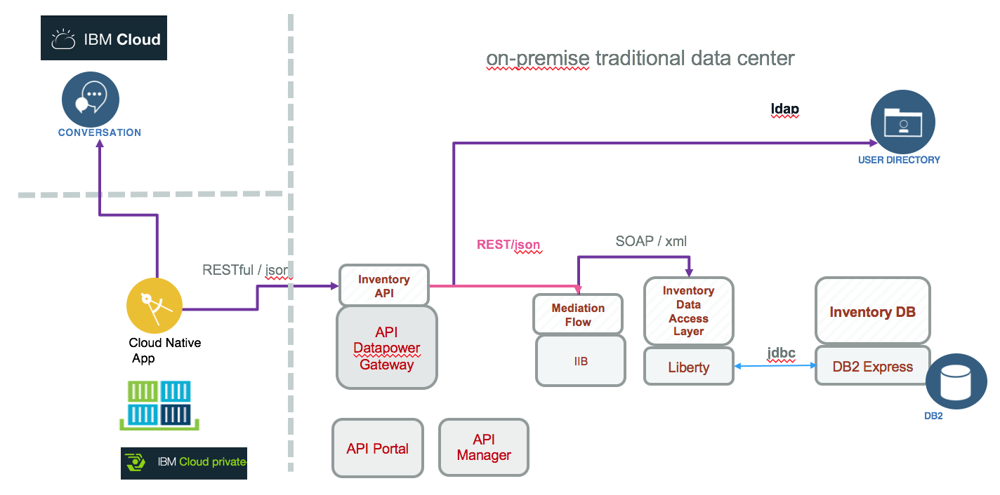
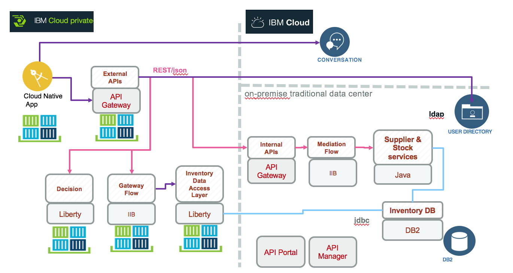
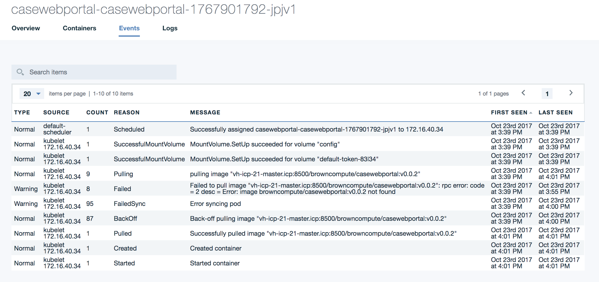
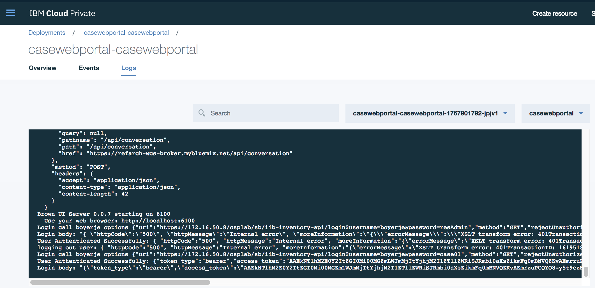

# IBM Cloud Private Deployment
In this section we are presenting how *Hybrid integration compute implementation* is deployed to IBM Cloud Private. For that we will address different configurations as business and operation requirements may differ per data center and even per business application.

Updated 11/16/2107

## Prerequisites
* A conceptual understanding of how [Kubernetes](https://kubernetes.io/docs/concepts/) works.
* A high-level understanding of [Helm and Kubernetes package management](https://docs.helm.sh/architecture/).
* A basic understanding of [IBM Cloud Private cluster architecture](https://www.ibm.com/support/knowledgecenter/SSBS6K_2.1.0/getting_started/architecture.html).
* Access to an operational IBM Cloud Private cluster.
* Install the IBM Cloud Private command line interface to manage applications, containers, services...
* Add a **browncompute** namespace using ICP admin console, under **Admin > Namespaces** menu


We will use this namespace to push *brown* components.

# ICP installation
For development purpose and tutorials, we are using a ICP EE deployment in a five virtual machine.
We also documented how to install ICP 2.1 Community edution on ubuntu VM [here](https://github.com/ibm-cloud-architecture/refarch-cognitive/blob/master/docs/ICP/README.txt)

For enterprise deployment the [following tutorial](https://github.com/ibm-cloud-architecture/refarch-privatecloud/blob/master/Installing_ICp_on_prem.md) will teach you hor to do the installation.

See also [ICP 2.1 product documentation](https://www.ibm.com/support/knowledgecenter/SSBS6K_2.1.0/installing/install_containers_CE.html) to get other details.

Also we are explaining in [this note](build-helm-rep.md) how to build your own Helm repository to be reference-able by ICP.

# Configurations
As an hybrid solution each component of the solution may run on existing on-premise server or on IBM Cloud Private. The deployment decision will be driven by the business requirements and the availability of underlying IBM middleware product as docker image.

For each component of the 'hybrid integration' solution the following needs may be done:
   * build the docker image
   * tag the image with information about the target repository server, namespace, tag and version
   * push the image to the remote docker repository (most likely the one inside ICP)
   * build the helm package from the chart definition
   * install the chart to ICP cluster using *helm* command line interface
   * access the URL end point

## Cfg 1: Cloud native application on ICP
This is the simplest deployment where the cloud native web application ([the 'case' portal](https://github.com/ibm-cloud-architecture/refarch-caseinc-app)) is deployed as container running in ICP, and accesses the back end service via API Connect running on-premise. All other components run on-premise.



This approach will be the less disruptive, let the development team innovating with new polyglot runtime environments supported by cloud native based application and micro services.

To support this configuration you just need to package the web application as docker container, define a helm chart for ICP deployment configuration settings, and use `helm` and `kubectl` command line interfaces.

The [following tutorial](https://github.com/ibm-cloud-architecture/refarch-caseinc-app/blob/master/docs/icp/README.md) presents how the web app is deployed in detail.

If you want to review each component here are their relative description:
* [API Connect - Inventory product](https://github.com/ibm-cloud-architecture/refarch-integration#inventory-management)
* [Gateway flow in integration broker](https://github.com/ibm-cloud-architecture/refarch-integration-esb#inventory-flow)
* [SOAP service for data access Layer](https://github.com/ibm-cloud-architecture/refarch-integration-inventory-dal#code-explanation)
* [Inventory database](https://github.com/ibm-cloud-architecture/refarch-integration-inventory-db2#inventory-database)

## Cfg 2: Web App, API Connect on ICP
The approach of this configuration is to deploy API management component to private cloud for the interaction APIs and keep the System APIs on-premise. This configuration is not yet supported as not all of those components are deployable on ICP. Only the API gateway is running on ICP.


The gateway flow running the interface mapping runs on IBM Integration bus on-premise: this configuration illustrates deep adoption of the ESB pattern leveraging existing high end deployments, scaling both horizontally and vertically. In this model the concept of operation for mediation and integration logic is kept.

* Deploy webapp to ICP [follows this tutorial](https://github.com/ibm-cloud-architecture/refarch-caseinc-app/blob/master/docs/icp/README.md)
* Deploy API Connect gateway from ICP Catalog using [this tutorial](https://github.com/ibm-cloud-architecture/refarch-integration-api/blob/master/docs/icp/README.md)

When API Connect will support full container deployment this configuration will be completed.
For the other component read:
*

## Cfg 3: Web App, API Connect and Liberty App on ICP

For this configuration the web service application running on WebSphere Liberty profile is moved to ICP, while IIB stays on premise, as well as the data base servers. Basically the approach is to keep heavy investment as-is as they are most likely supporting other data base and message flows for other applications. Still the light weight applications and runtime environment can move easily to ICP.


To support this configuration on top of config 2, the  *Inventory Data Access Layer* app running on Liberty is packaged as docker container and deployed using helm chart deployment configuration. Please read [this article](https://github.com/ibm-cloud-architecture/refarch-integration-inventory-dal/blob/master/docs/icp/README.md) to assess how it is done.

The LDAP, DB2 server servers are still running on Traditional IT servers.

## Cfg 4: Integration outside of ICP
This configuration is using integration components on premise and the other more lightweight components on ICP, but also use integration flow as micro-service for integration as introduced in [this article](https://developer.ibm.com/integration/blog/2017/04/16/12-factor-integration/)



We have added also ODM deployed in container.

This approach leverages existing investment and IIB concept of operation, and IBM Datapower for security and API gateway. This approach has an impact on the way to manage application inside IIB. Instead of deploying multiple applications inside one instance of IIB, we are packaging the app and IIB runtime into a unique container to deploy in pods and facilitate horizontal scaling. The vertical scaling delivered out of the box in IIB is not leveraged.

* Deploy webapp to ICP [follows this tutorial](https://github.com/ibm-cloud-architecture/refarch-caseinc-app/blob/master/docs/run-icp.md)
* Deploy Java application running on Liberty [read this tutorial](https://github.com/ibm-cloud-architecture/refarch-integration-dal/blob/master/icp/README.md))
* Deploy IBM Integration Bus [read this tutorial](https://github.com/ibm-cloud-architecture/refarch-integration-esb/blob/master/IBMCloudprivate/README.md))


## Cfg 5: IIB to ICP
This configuration runs every component on ICP, leverage public cloud service, and on-premise directory services.


## Use ICP Catalog
A packaged application can be used as template for creating application. Using the ICP admin console you can get the list of repositories using the ** Admin > Repositories ** :


Once the helm chart is packaged, a zip file is created and the publishing steps look like the following:

* copy the tfgz file to an HTTP server. (172.16.0.5 is a HTTP server running in our data center). Be sure to have write access to it.
```
$ scp casewebportal-0.0.1.tgz admin@172.16.0.5/storage/local-charts
```
* Then you need to update your private catalog index.yaml file.  The index file describes how your applications is listed in the ICP Application Center:
```
$ curl get -k https://9.19.34.107:8443/helm-repo/charts/index.yaml
$ helm repo index --merge index.yaml --url http://9.19.34.117:/storage/CASE/refarch-privatecloud ./
$ scp index.yaml admin@9.19.34.107:8443/helm-repo/charts
```

Once the repository are synchronized your helm chart should be in the catalog:


## Troubleshooting
When you deploy a helm chart you can assess how the deployment went using the ICP admin console or the kubectl CLI. For the user interface, go to the ** Workloads > Deployments ** menu to access the list of current deployments. Select the deployment and then the pod list.
In the pod view select the events to assess how the pod deployment performed



and the log file in *Logs* menu



Using kublectl to get the status of a deployment
```
$ kubectl get deployments --namespace browncompute
> NAME                          DESIRED   CURRENT   UP-TO-DATE   AVAILABLE   AGE
casewebportal-casewebportal   1         1         1            1           2d

```
Get the logs and events
```
$  export POD_NAME=$(kubectl get pods --namespace browncompute -l "app=casewebportal-casewebportal" -o jsonpath="{.items[0].metadata.name}")

$ kubectl logs $POD_NAME --namespace browncompute

$  kubectl get events --namespace browncompute  --sort-by='.metadata.creationTimestamp'
```

## Build server
The build server will also stay on-premise as it is used by "multiple teams". This approach is to illustrate a real hybrid IT environment (We do not need to proof that all the pieces can run on cloud based solutions).

As an example we are configuring the *build* server to be able to build the different docker images of our solution. The figure below illustrates what need to be done:


A Jenkins server implements different pipeline to pull the different project from github, executes each jenkins file to build the different elements: compiled code, docker image, helm package.
