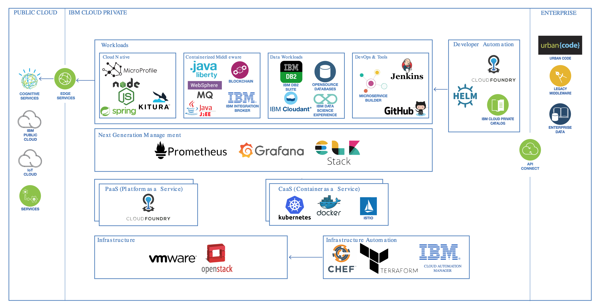

# Journey to the cloud
This article regroups some demonstration / presentation scripts we can use to present the Cloud Adoption journey using existing material.

## Cloud Values
* rapid deployment, scalability, ease of use, and elasticity
* predictable cost, optimized for workload demand
* enable DevOps, increase developers productivity
Private cloud adds:
* knowledge of where data resides
* apply own enterprise own security and governance policies
* simplify integration to on-premise business functions

[IBM Public Cloud](https://www.ibm.com/cloud/)
* Easy migration
* Adopt cloud native development and operations
* AI Ready
* Hybrid integration
* Secure: continuous security scanning for apps and data
* Easily integrate and manage all your data across vendors and clouds — on or off premises

[See catalog of services, capabilities](https://console.bluemix.net/)

## [Private Cloud reference architecture](https://www.ibm.com/cloud/garage/architectures/private-cloud)
Kubernetes platform with optimized scheduling, all IBM Middleware portfolio moving to it and ...:
* cluster management, security capabilities, image repositories, routing services, and microservices mesh
* authorize infrastructure automation with scripts (Terraform, [IBM Multi Cloud Manager](https://www.ibm.com/cloud/smartpapers/multicloud-management/))
* A private cloud platform provides monitoring for container-based applications to provide logging, dashboards, and automation. It supports network and storage policy-based controls for application isolation and security, and automated application health checking and recovery from failures
* All IBM middleware product moving to ICP

[ICP Product page](https://www.ibm.com/cloud-computing/products/ibm-cloud-private/)

## [Hybrid cloud management](https://www.ibm.com/cloud/smartpapers/multicloud-management/)
Hybrid, multicloud world is quickly becoming the new normal for enterprise.

## Cloud Architecture Solution Engineering Assets
[Asset lists](https://ibm-cloud-architecture.github.io/)

## Problems to solve
Operation lead (Todd), responsible for infrastructure management, security and environment availability and maintenance has different concerns than developer (Jane) who is responsible to develop new application but also maintain existing application.

### Taking existing WebSphere workloads to cloud deployment
* 10-15% of app can be moved as-is to cloud.

#### Lift and shift
* Java based lift and shift
 A Traditional JEE app running on WebSphere Application server can be lift and shift to WAS on IBM Cloud. The [Inventory Data Access Layer](https://github.com/ibm-cloud-architecture/refarch-integration-inventory-dal) is a JaxWS application exposing a SOAP APIs. The figure below shows the deployed app in the IBM console   
 .  
 The application is accessing a DB2 via JDBC. [Deployment explanation on tWAS](https://github.com/ibm-cloud-architecture/refarch-integration-inventory-dal/blob/master/docs/twas/readme.md)
 We are presenting how to move an integration solution to IBM Cloud in this article: [Lift and shift of an integration solution](https://github.com/ibm-cloud-architecture/refarch-integration/tree/master/docs/toSaaS).

 With a deep dive Java EE migration path in [this repository](https://github.com/ibm-cloud-architecture/refarch-jee/blob/master/phases/phase1.md)

 A [migration strategy tool](http://whichwas.mybluemix.net/) to support migration. [WAS V9 TCO Calculator](https://roi-calculator.mybluemix.net/).

 The Transformation Advisor application [deployable on ICP](https://ibm-dte.mybluemix.net/ibm-websphere-application-server-cloud-enabled)  

 [The Migration Toolkit for Application Binaries](https://developer.ibm.com/wasdev/downloads/#asset/tools-Migration_Toolkit_for_Application_Binaries) provides a command line tool that quickly evaluates application binaries for rapid deployment on newer versions of WebSphere Application Server traditional or Liberty.

 Finally the [source migration toolkit](https://developer.ibm.com/wasdev/downloads/#asset/tools-WebSphere_Application_Server_Migration_Toolkit) is an Eclipse-based Migration Toolkit provides a rich set of tools that help you migrate applications from third-party application servers, between versions of WebSphere Application Server, to Liberty, and to cloud platforms.

* MQ lift and shift  
We are presenting some [simple implementation](https://github.com/ibm-cloud-architecture/refarch-mq-messaging) using MQ on premise with MDB on WAS and a lift and shift path to [MQ on Cloud](https://www.ibm.com/cloud/mq) in [this note]()
The benefits to run MQ on cloud is that you keep your skill set but use cloud speed to:
* create queue manager in minute
* get product upgrade and patch done by IBM
* Pay as you use.
* Integrate with MQ manager on premise.  

* DB2 lift and shift
[We are presenting different approaches ](https://github.com/ibm-cloud-architecture/refarch-integration-inventory-db2/blob/master/docs/db2-cloud.md) to migrate DB2 database to DB2 on cloud.

* Message Broker / IBM Integration Bus

### Refactoring app to microservices
Business wants to improve the application to increase client adoption and satisfaction. Monolitic applications are more difficult to change and moving to microservice architecture will bring velocity to the development team.

A need to shift from IaaS (VM, network, storage, security) to container and CaaS (kubernetes) and PaaS (cloud foundry).

[The process to start from an existing JEE to split into microservices is documented in this repository](https://github.com/ibm-cloud-architecture/refarch-jee)
[WebSphere on the Cloud: Application Modernization](https://www.ibm.com/blogs/bluemix/2017/08/websphere-on-the-cloud-application-modernization/)

### Innovate quickly with cloud native development
Leverage tutorials
* [Tutorial: Deploy a cloud-native application in Kubernetes](https://www.ibm.com/cloud/garage/demo/try-private-cloud-install-an-app)

* Use one the available boiler plate, starting code.
[Nodejs, java, python, go, swift boiler plates](https://console.bluemix.net/developer/appservice/starter-kits)

### Leverage public cloud services in a hybrid model

## DevOps

## Public cloud for dev and test
[Stock trader app to ICP and Public](https://www.youtube.com/watch?v=pM3oFNAH2dA&index=4&list=PLzpeuWUENMK37ZlLBc_pIlXlOWeGnYRA_)

## Serverless
