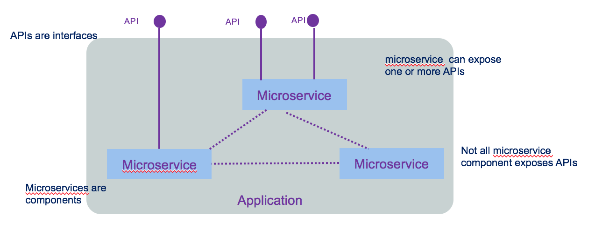
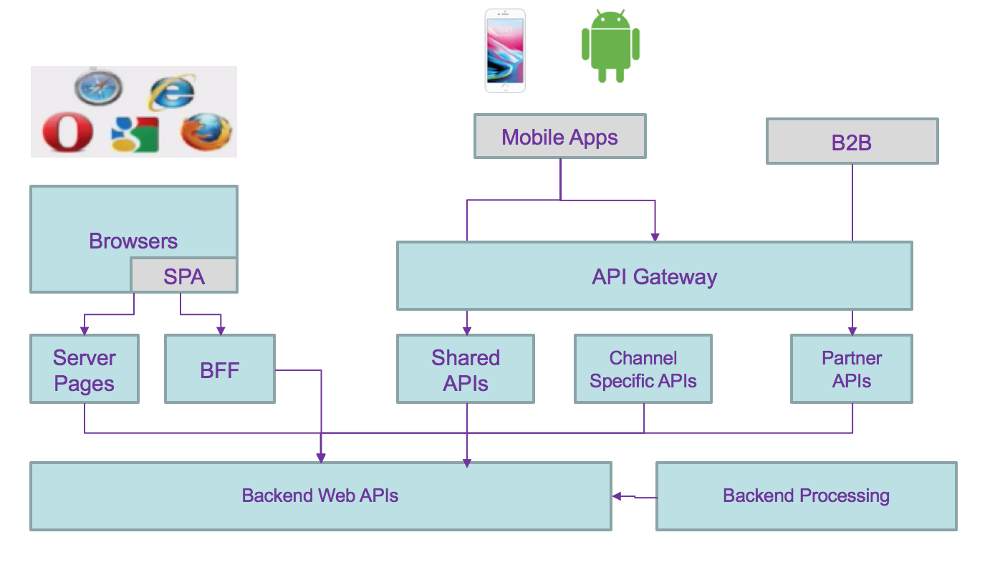
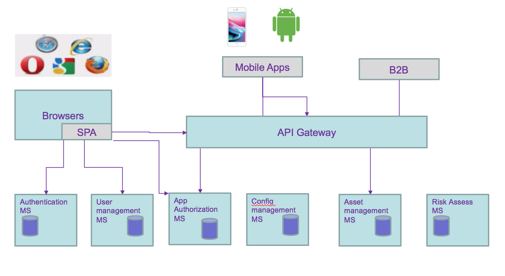
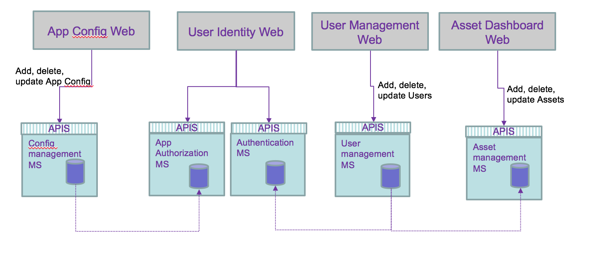
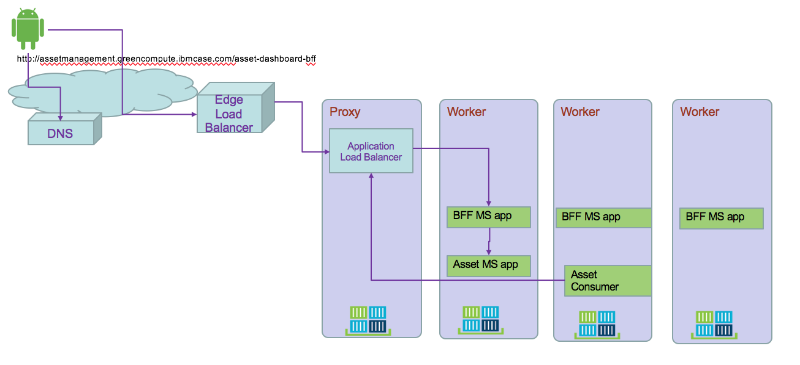
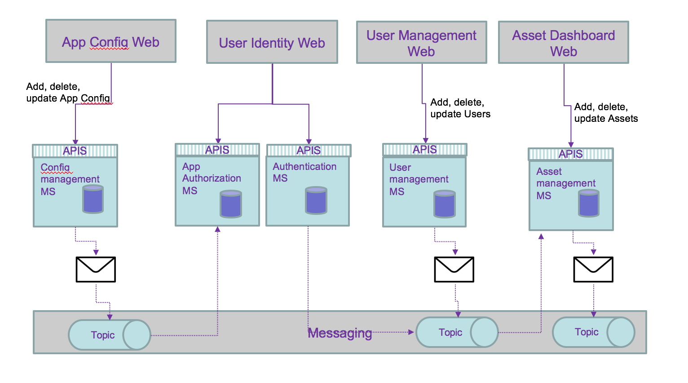
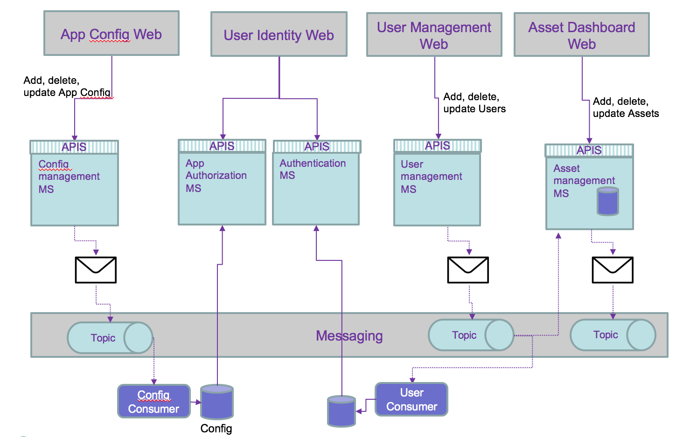

# Microservice mesh
In this note we are grouping the studies around microservice to microservice communication with kubernetes deployment. We are addressing:
* how ingress controller helps inside kubernetes
* how API gateway helps for API management and service integration
* how to expose service in hybrid cloud
* how to discover service

All come back to the requirements, skill set and fit to purpose.

## Definitions
Some misconception to clarify around microservice and APIs:
* microservices are not fine grained web services
* APIs are not equivalent to microservices
* microservices are not implementation of APIs

API is an interface, a way to make a request to get or change data in an application. In modern use API refers to REST web APIs using HTTP protocol, with JSON format (sometime XML is still used). Interface decouples the caller from the implementation. The caller has no idea how it is implemented.

A microservice is in fact a component. micro refers to the granularity of the component not of the exposed interface. The following diagram illustrates all those concepts.



We encourage you to go to read [integration design and architecture series](https://developer.ibm.com/integration/blog).  
## Context
Traditional modern architecture involves having different components exposing reusable APIs, addressing different channels (mobile, single page application, traditional server pages or B2B apps), consuming APIs (mobile APIs, back end for front end, shared common apis like authentication, authorization,...) and backend services addressing reusable business services:



API management can be added via API gateway. This is a distributed application with cross related communication channels, where any changes to the service interface characteristics impact any of the components.

Moving to microservices architecture style adds more communication challenges and devops complexity but provides a lot of business values such as:
* rapid deployment of new business capabilities, co-evolving in parallel of other services.
* focusing on business domain with clear ownership of the business function and feature roadmap
* better operation procedure, automated, and with easy rollout and continuous delivery.
* A/B testing to assess how new feature deployed improve business operations
* Improve resiliency by deploying on multi language cluster

As an example we can use the [following predictive maintenance asset solution](https://github.com/ibm-cloud-architecture/refarch-asset-analytics) with the following capabilities to support:
* user authentication
* user management: add / delete new user
* user self registration, reset password
* user permission control
* user profile
* asset management
* risk assessment service

Each could be grouped by business domain like the user management, asset management, and application access control. So domain separation can be a good microservice boundary. But if the number of user reach millions then we may need to optimize the runtime processing of reading user credential, and scale the service differently, leading to a service map like the diagram below, where runtime and management are separated services.

  

All of these still does not address the fact that data are distributed and even more with microservices owning their data persistence. As developers and architects we still have to address the following data integrity problems:
* two phase commit
* compensating operation
* eventual data consistency: some microservice updating data may share those updates with other microservices.
* Data aggregation: adding new views on data, owned by a microservice, to support new aggregates. Example of used are machine learning, analytics, business visibility...

From the previous microservice allocation we can see the needs to propagate data update between services. Adding or unsubscribing a user involves updating the asset the user own and the authentication runtime service

  

Adding a new application changes the authorization runtime service.

We are now looking at the following questions:
- how does webapp access APIs for their main service, of back end for front end service.
- how does deployed microservice access other service: discover and access?
- How data consistency can be ensured?
- is there a simpler way to manage cross microservice dependency?

The answers depend on the existing infrastructure and environment, and deployment needs.

## Service routing
We have to dissociate intra-cluster communication versus inter clusters or cluster to external services. Without getting into too much detail of IP routing within kubernetes some important elements of the cluster are important to remember:
* microservices are packaged as docker container and expose port. When deploy they run in a pod within a node (physical or virtual machine)
* containers can talk to other containers only if they are on the same machine, or when they have exposed port.
* Kubernetes is configured with a large flat subnet (e.g. 172.30.0.0/16) which is used for internal application traffic inside of the cluster. Each worker node in the Kubernetes cluster is assigned one or more non-overlapping slices of this network, coordinated by the Kubernetes master node.
When a container is created in the cluster, it gets assigned to a worker node and is given an IP address from the slice of the subnet for the worker node.


* Kube-proxy intercepts and controls where to forward the traffic, either to another worker node running your destination pod, or outside of the cluster
* Kube proxy watches the API Server on the Master Node for the addition and removal of Services endpoints. It configures the IPtable rules to capture the traffic for its ClusterIP and forwards it to one of the endpoints.
* Worker nodes have internal DNS service and load balancer


Within Kubernetes, Ingress is a service that balances network traffic workloads in your cluster by forwarding public or private requests to your apps. You use ingress when you need to support HTTP, HTTPS, TLS, load balancing, expose app outside of the cluster, custom routing rules...

One ingress resource is required by namespace. So if microservices are in the same namespace you can define a domain name for those services (e.g. assetmanagement.greencompute.ibmcase.com) and defined path for each service:
```yaml
apiVersion: extensions/v1beta1
kind: Ingress
metadata:
  name: assetmanagement
spec:
  rules:
    - host: assetmanagement.greencompute.ibmcase.com
      http:
        paths:
          - path: /assetconsumer
            backend:
              serviceName: asset-consumer-svc
              servicePort: 8080
          - path: /assetdashboard
            backend:
              serviceName: asset-dashboard-bff-svc
              servicePort: 8080
          - path: /assetmgrms
            backend:
              serviceName: asset-mgr-ms-svc
              servicePort: 8080
```
The backend for front end, the asset manager microservice and the asset consumer components are exposed in the same domain.
The `serviceName` matches the service exposed for each components.
The following diagram presents how an external application accesses deployed microservice within kubernetes pod.

The following diagram shows how Ingress directs communication from the internet to a deployed microservice:



1. A user sends a request to your app by accessing your app's URL. Using DNS name abstracts the application from the underlying infrastructure. Inter clusters microservice to microservice should use the same approach
1. A DNS system service resolves the hostname in the URL to the portable public IP address of the load balancer
1. Based on the resolved IP address, the client sends the request to the load balancer service that exposes the Application Load Balancer (ALB)
1. The ALB checks if a routing rule for the app path in the cluster exists. If a matching rule is found, the request is forwarded according to the rules that you defined in the Ingress resource to the pod where the app is deployed. If multiple app instances are deployed in the cluster, the ALB load balances the requests between the app pods. To also load balance incoming HTTPS connections, you can configure the ALB to you can use your own TLS certificate to decrypt the network traffic.
1. Microservice to microservice can use this DNS name to communicate between service.

Using Ingress, the global load balancer can support parallel, cross region, clusters.

## Service exposition
There is an architecture style focusing on APIs which proposes to have different SLA and semantic for external, internet facing API versus internal back end APIs only exposed within intranet. [This article](./hybrid-itg-platform.md)  presents using different API gateways to support this architecture.

Backend data services are not exposed directly to internet. API Gateway provides a secure end point for external web app to access those business functions.

So the decisions on how to expose service are linked to:
* do you need to do API management
* do you need to secure APIs
* do you need to expose to internet
* do you need to support other protocol then HTTP
* do you need to have multiple instance of the application

When deploying a microservice to kubernetes it is recommended to use Ingress rule as presented above.. The following yaml file exposes the BFF service using ClusterIP:
```yaml
apiVersion: v1
kind: Service
metadata:
  name: asset-consumer-svc
  labels:
    chart: asset-consumer
spec:
  type: ClusterIP
  ports:
  - port: 8080
    targetPort: 8080
    protocol: TCP
    name: asset-consumer-svc
  selector:
    app: asset-consumer
```

## Service discovery
When deploying on kubernetes cluster, microservices use the DNS lookup to discover deployed microservice.


## ISTIO
[ISTIO](https://istio.io/) provides an easy way to create a network of deployed services with load balancing, service-to-service authentication, monitoring, etc...
By deploying a special sidecar proxy throughout your environment, all network communication between microservice is intercepted and controlled by ISTIO control panel.

To deploy ISTIO to IBM cloud private see [this note]().

## Asynchronous loosely coupled solution using Events
So if we change of paradigm and use a messaging approach or better an event approach of the data update requirements. Now we need to think about the activities that apply within each service and how they can interest other component. They are becoming facts that something happen and can be published as events for other to consume. The first level of refactoring may become:  


An event is a fact that happens in the past and carry all the data needed, and it becomes a source of record. It becoming consistent if it is played in a messaging backbone via topics.

  

But the persistence of data can be externalized to consumer and then simplify the architecture:




Then we can use the history of the persisted event to add features not address before, and outside of the direct scope of a microservice. For example to compute the number of users added last month, just a query on the user topic will get the answer: no to very limited coding.
